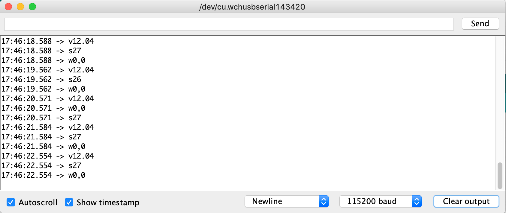

# Firmware

  English

We use a microcontroller unit (MCU) to act as a bridge between the robot body and the smartphone.  We provide our [firmware](openbot_uno/openbot_arduino_firmware.ino) for the Arduino Uno.

## Features

The main task of the MCU is to handle the low-level control of the vehicle and provide readings from low-level vehicle-mounted sensors. The MCU receives the vehicle controls and indicator signals via the serial connection. It converts the controls to PWM signals for the motor controller and toggles the LEDs according to the indicator signal. The Arduino program also keeps track of the wheel rotations by counting the interrupts of optical sensors on the left and right front wheels. It calculates the battery voltage by a scaled moving average of measurements at the voltage divider circuit. It can also measure the distance to obstacles in front of the car with an optional ultrasonic sensor. These measurements are sent back to the Android application through the serial link.

### Testing

This section explains how to test all functionalities of the car after the firmware was flashed successfully.

1. Confirm that:
    1. the wheels are not connected to the car
    2. the Arduino is connected to the computer
    3. the correct USB port is selected
2. Open the Serial Monitor: `Tools` :arrow_right: `Serial Monitor`

#### Sending messages to the OpenBot

You can also send messages to the Arudino by typing a command into the input field on the top and then pressing send. The following commands are available (provided the neccessary features are supported by the robot):

- `c<left>,<right>` where `<left>` and `<right>` are both in the range [-255,255]. A value of `0` will stop the motors. A value of `255` applies the maximum voltage driving the motors at the full speed forward. Lower values lead to proportionlly lower voltages and speeds. Negative values apply the corresponding voltages in reverse polarity driving the motors in reverse.
- `i<left>,<right>` where `<left>` and `<right>` are both in the range [0,1] and correspond to the left and right indicator LEDs. For example, `i1,0` turns on the left indicator, `i0,1` the right indicator and `i1,1` both indicators. Enabled indicator lights will flash once per second. A value of `i0,0` turns the indicators off. Only one state at a time is possible.
- `l<front>,<back>` where `<front>` and `<back>` are both in the range [0,255] and correspond to the brightness of the front and back LEDs.
- `s<time_ms>` where `<time_ms>` corresponds to the time in ms between sonar measurements triggered (default = 1000). After the sonar reading is aquired the message is sent to the robot. If it times out, the specified `MAX_SONAR_DISTANCE` is sent.
- `w<time_ms>` where `<time_ms>` corresponds to the time in ms between wheel odometry measurements sent to the robot (default = 1000). The wheel speed is monitored coniniously and and the rpm is computed as average over the specified time interval.
- `v<time_ms>` where `<time_ms>` corresponds to the time in ms between voltage measurements sent to the robot (default = 1000). The voltage is monitored continuously and filtered via a moving average filter of size 10. In addition to setting the time interval for voltage readings, sending this command will also trigger messages that report the minimum voltage to drive the motors (`vmin:<value>`), minimum battery voltage (`vlow:<value>`) and maximum battery vollage (`vmax:<value>`).
- `h<time_ms>` where `<time_ms>` corresponds to the time in ms after which the robot will stop if no new heartbeat message was received (default = -1).
- `b<time_ms>` where `<time_ms>` corresponds to the time in ms after which the bumper trigger will be reset (default = 750).
- `n<color>,<state>` where `<color>` corresponds to a status LED (`b` = blue, `g` = green, `y` = yellow) and `state` to its value (`0` = off, `1` = on).
- `f` will send a request to the OpenBot to return a message with the robot type and its features, e.g. voltage measurement (`v`), indicators (`i`), sonar (`s`), bump sensors (`b`),  wheel odometry (`wf`, `wb`), LEDs (`lf`, `lb`, `ls`), etc. For example, for the `RTR_V1` version of OpenBot the message would look like this: `fRTR_V1:v:i:s:b:wf:wb:lf:lb:ls:`.

#### Receiving messages from the OpenBot

Depending on your configuration you may see different messages.

- Messages that start with `v` report the battery voltage. If you connect the battery to the car (i.e. turn on the switch), it should show the battery voltage. If you disconnect the battery (i.e. turn off the switch), it should show a small value.
- Messages that start with `w` report readings of the speed sensors measured in revolutions per second (rpm). Each hole in the encoder disk will increment a counter by plus/minus one depending on the direction. You can set the number of holes with the parameter `DISK_HOLES`. If you are using the stardard disk with 20 holes, there will be 20 counts for each revolution of the wheel.
- Messages that start with `s` report the estimated free space in front of the ultrasonic sensor in cm. If the ultrasonic sensor is disabled or unable to get a reading, it will show `65535`.
- Messages that start with `b` report collisions. The codes `lf` (left front), `rf` (right front), `cf` (center front), `lb` (left back), `rb` (right back) indicate which sensor triggered the collision.

#### Test procedure

Before you proceed, make sure the tires are removed. You will need the Serial Monitor open to send commands and you will see the messages received from your OpenBot. If you have the OLED display installed, you will also see the vehicle status displayed there in a more human-readable format. The following test procedure can be used to test all functionalities of the car:

1. Turn on the car and observe the battery voltage (first value). You can verify the reading with a multimeter and adjust the `VOLTAGE_DIVIDER_FACTOR` if neccessary.
2. If you have a ultrasonic sensor installed:
    1. Hold your hand in front of the sensor and move it back and forth. You should see the readings (fourth value) change correspondingly.
    2. We have observed that the ultrasonic sensor is very sensitive to vibrations! So it is advisable to make sure you will get reliable readings during operation by performing the following test:
        1. Place the OpenBot with the ultrasonic sensor installed such that there is at least 200cm of free space in front of it. You should see a reading of `200` or more.
        2. Observe the readings on the serial monitor for some time and then enter the command `c128,128`.
        3. If the sensor readings change significantly, you will need to dampen the vibrations transmitted to the ultrasonic sensor from the chassis (e.g. add some silicon, adjust the mounting position).
3. If you have the speed sensors installed:
    1. Make sure, you have plenty of free space in front of the ultrasonic sensor. The reading (fourth value) needs to be at least above the `STOP_THRESHOLD` which is `10` by default. If the ultrasonic sensor is not installed, you should see a reading of `65535`.
    2. Send the command `c128,128`. The motors will start spinning at *slow speed* (50% PWM). The speed sensor readings (second and third value) should be similar to the values in the image above. If you are using the DIY version or a weaker battery, values may be lower. Check that all motors are spinning forward and that the speed sensor readings are positive. Note: If you multiply these values by 3, they correspond to the rpm for the standard disk with 20 holes.
    3. Try sending different controls and observe the speed sensor readings. For example, the command `c-128,-128` will spin all motors backward at *slow speed* (50% PWM). The command `c255,-255` will spin the left motors forward and the right motors backward at *fast speed* (100% PWM). The command `c-192,192` will spin the left motors backward and the right motors forward at *normal speed* (75% PWM).
4. Stop the motors by sending the command `c0,0` or by holding your hand in front of the ultrasonic sensor
5. If you have the indicator LEDs installed, send the command `i1,0` and observe the left indicator light flashing. The send the command `i0,1` and observe the right indicator light flashing. Finally, turn the indicator off by sending the command `i0,0`.

### No Phone Mode

Before testing the car with a smartphone that has the OpenBot application installed, you can also test the car without a phone first. Simply set the option `NO_PHONE_MODE` to `1`. The car will now drive at *normal_speed* (75% PWM) and slow down as it detects obstacles with the ultrasonic sensor. Once it gets close to the `TURN_THRESHOLD` (default: 50cm), it will start turning in a random direction and turn on the LED on that side. If the estimated free space in front of the car falls below the `TURN_THRESHOLD`, it will slowly go backwards and both LEDs will turn on. Note that both the car and the Arduino need to be powered. The Arduino can be powered by connecting the 5V pin to the 5V output of the L298N motor driver, or by connecting the USB cable to a power source (e.g. phone).

Before running the car, we recommend to remove the tires, connect the Arduino to a computer and observe the serial monitor like in the section [Testing](#testing). The output on the serial monitor is a bit easier to parse (same as OLED) and shows the battery voltage, the rpm for the left and right motors and the estimated free space in front of the car. You can move a large object back and forth in front of ultrasonic sensor and observe the speed of the motors changing.

:warning: WARNING: If you do not have an ultrasonic sensor installed or if it is disabled, the car will just drive forward at *normal_speed* (75% PWM) and will eventually collide. Even with the sensor installed, the car may collide occasionally due to noisy readings.

## Next

Compile and run the [Android App](../android/README.md)
